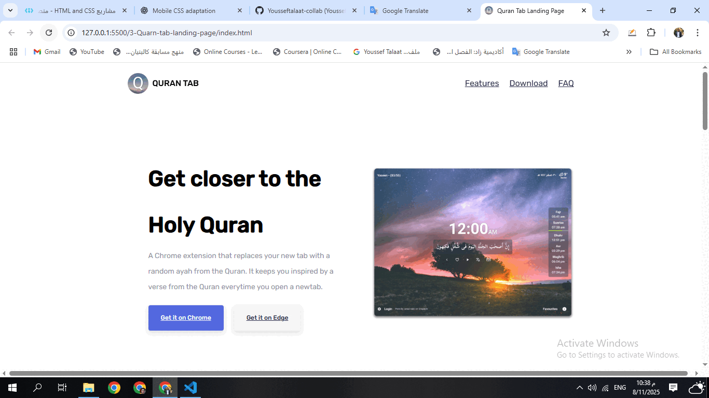

<h1 align="center">📖 Quran Tab Landing Page</h1>

A modern and responsive <strong>HTML</strong> & <strong>CSS</strong> landing page for the <em>Quran Tab</em> browser extension.  
Designed to present its features, encourage downloads, and provide a visually calming experience inspired by the Holy Quran.

<h2>📸 Preview</h2>

  

<h2>📱 Mobile-Friendly</h2>
<ul>
  <li>✅ Fully responsive layout for all devices</li>
  <li>✅ Clear, minimalist design with focus on the main message</li>
  <li>✅ Prominent download buttons for Chrome and Edge</li>
</ul>

<h2>🛠️ Tech Stack</h2>
<ul>
  <li>🧱 HTML5 (semantic structure)</li>
  <li>🎨 CSS3 (custom properties, responsive design)</li>
  <li>⚡ Flexbox for alignment</li>
</ul>

<h2>🚀 Live Demo</h2>

🌐 View here: <a href="https://yousseftalaat-collab.github.io/Quran-Tab-Landing-Page/" target="_blank">Live Project</a>

📂 GitHub Repo: <a href="https://github.com/Yousseftalaat-collab/Quran-Tab-Landing-Page" target="_blank">Repository</a>

<h2>🧠 What I Practiced</h2>
<ul>
  <li>Building landing page layouts with Flexbox</li>
  <li>Creating clean and engaging hero sections</li>
  <li>Optimizing CTAs (Call to Actions) for conversions</li>
</ul>

<h2>🧪 How to Run</h2>
<ol>
  <li>📥 Clone or download the repository</li>
  <li>📂 Open <code>index.html</code> in your browser</li>
  <li>✅ Done! No extra setup required</li>
</ol>

<h2>💬 Contact</h2>

📧 Email: <a href="mailto:yousseftalaat142@gmail.com">yousseftalaat142@gmail.com</a>

🔗 LinkedIn: <a href="https://www.linkedin.com/in/youssef-talaat-1aa2671b3/">Youssef Talaat</a>

🐱 GitHub: <a href="https://github.com/Yousseftalaat-collab">Yousseftalaat-collab</a>

---

<h3 align="center">✨ Created & Maintained by <strong>Youssef Talaat</strong></h3>
